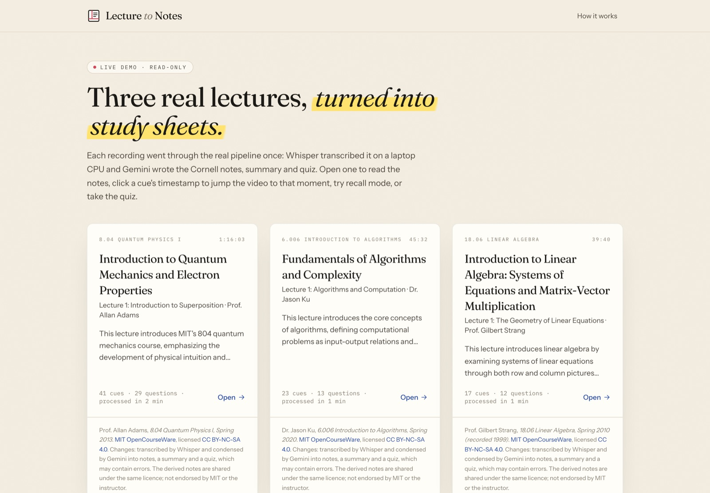
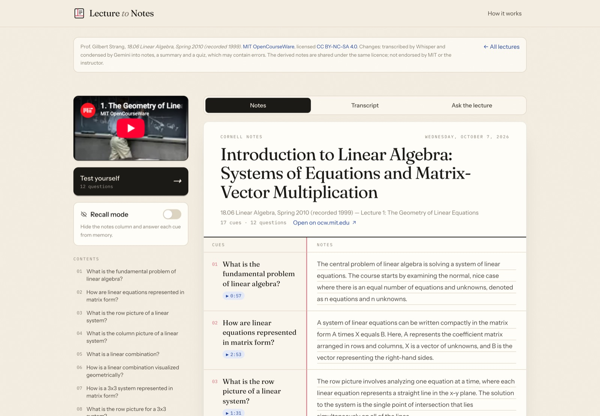
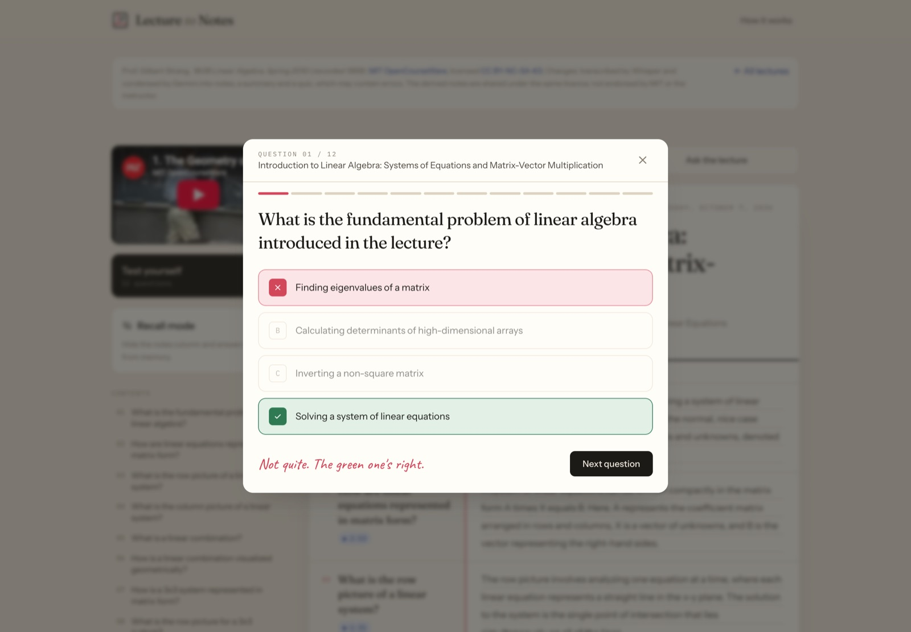
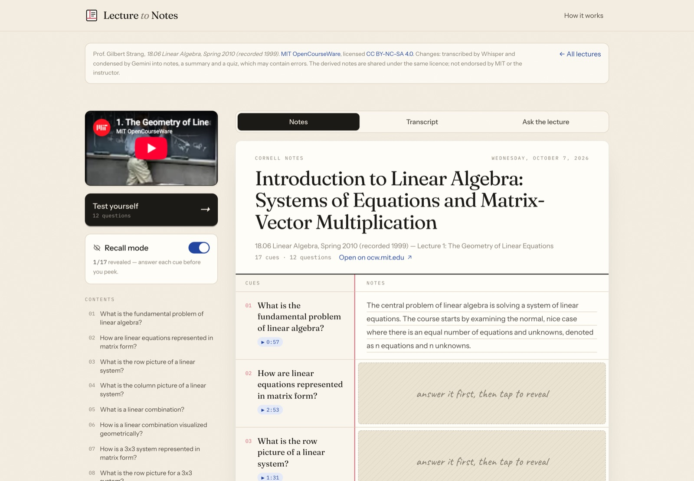
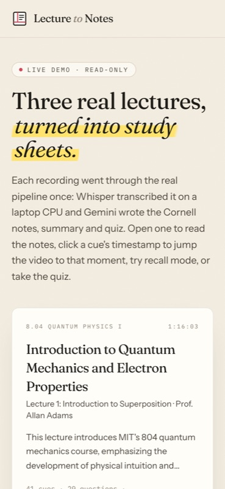

# Lecture to Notes



**Live demo: [https://notes.68-233-96-25.sslip.io/guest](https://notes.68-233-96-25.sslip.io/guest?k=sh48YXkAWVfNIDpfO9vBSVqjnc4HoXIt)**: a read-only gallery of three openly licensed MIT OpenCourseWare lectures, processed once with the real pipeline (see [Live demo](#live-demo)).

Upload a lecture recording **or paste a link** (YouTube, Vimeo, most lecture platforms, or a direct media URL) and get a **Cornell notes sheet** where every cue links back to the moment it was taught, a **summary**, a **practice quiz**, a searchable **transcript**, and an **"Ask the lecture"** chat, exportable as Markdown, PDF, or Anki flashcards.

## Measured

Full pipeline (`cli.py`: ffmpeg → Whisper `base` on CPU → Gemini `gemini-flash-lite-latest`), Apple M4 laptop, 2026-10-06:

| Lecture | Audio | Wall time | Output |
|---|---|---|---|
| MIT 8.04 Quantum Physics I, lecture 1 | 76 min | **2 min 17 s** | 41 cues, 29 quiz questions |
| MIT 6.006 Introduction to Algorithms, lecture 1 | 46 min | 1 min 9 s | 23 cues, 13 questions |
| MIT 18.06 Linear Algebra, lecture 1 | 40 min | 1 min 3 s | 17 cues, 12 questions |

Most of the time is Whisper; the Gemini stage is a few calls per lecture (one per ~2,250-word part, 3 in parallel, plus the summary). Times depend heavily on the CPU and Whisper model size. **45 backend tests** (`pytest`, ~4 s) cover the pipeline stages and the API with Whisper, ffmpeg and Gemini mocked.

<table><tr>
<td></td>
<td></td>
</tr><tr>
<td></td>
<td align="center"></td>
</tr></table>

## Architecture

```
 lecture.mp4 ─┐
              ├─▶ ffmpeg ──▶ 16 kHz WAV ──▶ Whisper (10-min pieces) ──▶ timestamped transcript
 YouTube URL ─┘ (yt-dlp, audio only)                                          │
                                                          chunks with [m:ss] markers, 3 in parallel
                                                                               │
                                                               Gemini (JSON mode, model fallback)
                                                                               │
                                                     pydantic-validated notes.json (cue → start time)
                                                                               │
                                        React UI: Cornell sheet + player · transcript · ask · quiz · exports
```

| Layer | Stack |
|---|---|
| Ingestion | file upload, or [yt-dlp](https://github.com/yt-dlp/yt-dlp) fetching the audio-only stream from a link (public addresses only) |
| Transcription | ffmpeg, [openai-whisper](https://github.com/openai/whisper) (`base`, CPU), long files in 10-minute pieces |
| Notes / Q&A | Gemini via `google-genai`, pydantic v2 validation, retry + sticky model fallback |
| API | FastAPI, SQLite + SQLAlchemy, email/password accounts (scrypt + JWT), single-worker background thread |
| Frontend | React 19, Vite, Tailwind v4, react-dropzone, axios |
| Deploy | Docker → Render (backend), Vercel (frontend) |

## Features

- **Cornell sheet** with a contents rail and **recall mode** (notes hidden until you tap — the Cornell self-test step).
- **Jump to the moment**: each cue has a `▶ 12:05` chip that seeks the embedded YouTube video, or the stored audio for uploads.
- **Transcript tab** with search and clickable timestamps.
- **Ask the lecture**: questions answered only from the transcript, with links to the supporting moments.
- **Quiz** with keyboard controls, options reshuffled every round, missed-question review and "retry the ones I missed".
- **Exports**: Markdown, print-to-PDF, and Anki (`File → Import` picks up deck and columns automatically).
- **Accounts**: every lecture is private to its owner. The first account created also claims any lectures made before accounts existed.
- **Cancel** a lecture at any stage; **housekeeping** deletes the original upload once transcribed and removes lectures after `RETENTION_DAYS`.

## Run locally

Prerequisites: Python 3.12+, Node 20+, `ffmpeg` on PATH (`brew install ffmpeg`), a Gemini API key.

```bash
# backend
cd backend
python -m venv ../.venv && source ../.venv/bin/activate
python -m pip install -r requirements-dev.txt
cp .env.example .env          # put your GEMINI_API_KEY in it
uvicorn app.main:app --reload --port 8000

# frontend (another terminal)
cd frontend
npm install
npm run dev                   # http://localhost:5173 → create an account on the landing page
```

Pipeline only, no server:

```bash
cd backend
python cli.py path/to/lecture.mp4 -o ../outputs     # → outputs/transcript.json, notes.json, notes.md
python cli.py x -o ../outputs --from-transcript     # re-run just the LLM stage
```

Tests (`cd backend && pytest`): 45 tests, pipeline stages mocked — no ffmpeg, Whisper, network or API key needed.

## Live demo

[https://notes.68-233-96-25.sslip.io/guest](https://notes.68-233-96-25.sslip.io/guest?k=sh48YXkAWVfNIDpfO9vBSVqjnc4HoXIt) is a **read-only** build of the same React app: no backend, no uploads, no Gemini calls.

- **Content**: three lectures from [MIT OpenCourseWare](https://ocw.mit.edu), each under [CC BY-NC-SA 4.0](https://creativecommons.org/licenses/by-nc-sa/4.0/): Prof. Allan Adams, [8.04 Quantum Physics I, Lecture 1](https://ocw.mit.edu/courses/8-04-quantum-physics-i-spring-2013/resources/lecture-1/) (Spring 2013); Dr. Jason Ku, [6.006 Introduction to Algorithms, Lecture 1](https://ocw.mit.edu/courses/6-006-introduction-to-algorithms-spring-2020/resources/lecture-1-algorithms-and-computation/) (Spring 2020); Prof. Gilbert Strang, [18.06 Linear Algebra, Lecture 1](https://ocw.mit.edu/courses/18-06-linear-algebra-spring-2010/resources/lecture-1-the-geometry-of-linear-equations/) (Spring 2010). Each was downloaded from the archive.org link on its OCW page and run through `cli.py` once. The page credits each lecture and its licence, and plays the official MIT OpenCourseWare YouTube upload, so cue timestamps seek the real video.
- **What works**: Cornell sheet, ▶ timestamp links, recall mode, transcript search, quiz, Markdown/PDF/Anki export. Uploading and *Ask the lecture* are switched off with a note: transcription runs Whisper on your own CPU and the notes use your own Gemini key, so the app is meant to run locally (the demo server has 1 GB of RAM, and open uploads would spend one person's API quota).
- **How it's built**: `npm run build:demo` (`frontend/vite.demo.config.js`) aliases `../lib/api` to `src/demo/api.js`, which serves the pre-processed lectures, so `NotesView`, `Player`, `TranscriptPanel` and `QuizModal` run unchanged. The JS, CSS and lecture data are inlined into a single `index.html` (~630 KB, ~170 KB gzipped).
- **How it's served**: Caddy serves that one file as static content (no app process) at `/guest?k=<key>` only; every other path is 404, `robots.txt` disallows everything, and responses carry `X-Robots-Tag: noindex` and `Referrer-Policy: strict-origin` (the key never leaves in a Referer header). The key lives only on the server; `python3 guest.py rotate` issues a new one (the old link stops working), `show` prints it, `off` disables the link, each followed by a graceful Caddy reload. Setup and redeploy: [`demo/`](demo/).

Generated notes are machine-written and can contain mistakes; they are not endorsed by MIT or the instructors.

## API

All routes except `/health`, `/auth/*` and `/media/*` need `Authorization: Bearer <token>`. Other users' lectures return 404.

| Method | Path | Description |
|---|---|---|
| `POST` | `/auth/signup`, `/auth/login` | `{email, password}` → `{token, user}` (throttled per IP) |
| `GET` | `/auth/me` | current user |
| `POST` | `/upload` | multipart `file` → 202 job; 415 unsupported, 400 empty, 413 too big, 429 too many active jobs |
| `POST` | `/upload-url` | `{url}` → 202 job; 400 for non-public / non-http(s) links |
| `GET` | `/status/{id}` | `queued → [downloading →] transcribing → processing → done \| error \| cancelled`, plus `stage` text |
| `POST` | `/jobs/{id}/cancel` | stop a queued or running lecture |
| `GET` / `DELETE` | `/jobs`, `/jobs/{id}` | your library / delete (stops it first if running) |
| `GET` | `/notes/{id}` · `/notes/{id}/markdown` · `/notes/{id}/anki` | notes JSON and exports |
| `GET` | `/transcript/{id}` | timestamped segments |
| `POST` | `/ask/{id}` | `{question, history}` → `{answer, timestamps}` |
| `GET` | `/media-token/{id}` → `/media/{id}?token=` | short-lived, lecture-scoped URL for the audio player (supports Range) |

Notes schema (`backend/app/pipeline/schema.py`):

```json
{
  "topic": "string",
  "summary": "string",
  "cornell_notes": [{ "cue": "string", "note": "string", "start": 74.0 }],
  "mcqs": [{ "question": "string", "options": ["A", "B", "C", "D"], "answer": "exact option text" }]
}
```

## Configuration (`backend/.env`)

| Var | Default | Purpose |
|---|---|---|
| `GEMINI_API_KEY` | — | required |
| `GEMINI_MODEL` | `gemini-flash-lite-latest` | primary model |
| `GEMINI_FALLBACK_MODELS` | `gemini-3.5-flash-lite,gemini-3.6-flash,gemini-3.5-flash` | tried when the primary fails; the last model that worked is tried first next time |
| `WHISPER_MODEL` | `base` | `tiny`/`base`/`small`/`medium` |
| `JWT_SECRET` | auto-generated into `DATA_DIR/.jwt_secret` | **set this in production** |
| `TOKEN_TTL_HOURS` | `336` | sign-in lifetime |
| `ALLOW_SIGNUP` | `true` | set `false` to close registration |
| `RETENTION_DAYS` | `30` | delete lectures older than this (`0` = never) |
| `MAX_ACTIVE_JOBS_PER_USER` | `3` | in-flight lectures per account |
| `MAX_UPLOAD_MB` | `500` | caps uploads and link downloads |
| `CORS_ORIGINS` | `http://localhost:3000,http://localhost:5173` | frontend origins |
| `DATA_DIR` | `backend/data` | uploads, outputs, `jobs.db`, JWT secret |

Frontend: `VITE_API_URL` (default `http://localhost:8000`).

## Security notes

- Link downloads: only `http(s)` on ports 80/443, hostnames must resolve to public IPs (blocks localhost, LAN, cloud metadata), yt-dlp is limited to its known-site extractors, and direct media links have every redirect hop validated. DNS rebinding between the check and the fetch is still theoretically possible; run the backend without access to sensitive internal services.
- Passwords are hashed with scrypt; tokens are HS256 JWTs. Login/signup are rate-limited in memory (per process).
- Tokens live in `localStorage`, so keep the frontend free of third-party scripts.

## Deploy

- **Backend → Render**: `render.yaml` defines a Docker web service with a disk at `/data`. Set `GEMINI_API_KEY`, `JWT_SECRET` and `CORS_ORIGINS` (your Vercel URL). Whisper needs more than the free tier's 512 MB RAM.
- **Frontend → Vercel**: root directory `frontend`, env `VITE_API_URL=https://<your-render-service>.onrender.com`.

## Project layout

```
backend/
  app/main.py            routes          app/auth.py    accounts, JWT, throttle
  app/jobs.py            worker, cancel, cleanup, retention sweep
  app/db.py              User + Job models, tiny column migration
  app/pipeline/          download → audio → transcribe → chunking → notes / ask (llm.py) → export
  cli.py                 run the pipeline on one file
  tests/                 pytest (pipeline + API)
frontend/src/
  App.jsx                auth + job state machine, #job=<id> deep links
  components/            Landing, AuthCard, IntakeCard, ProcessingView, NotesView, Player,
                         TranscriptPanel, AskPanel, QuizModal, Library, Nav
  demo/                  read-only demo: DemoApp (gallery), api.js stand-in, lectures + data/
demo/                    build_data.py (CLI outputs → demo data), Caddy site, guest.py, deploy.sh
```

## License

Code: [MIT](LICENSE) © 2026 Shravan Kishore.

The demo content in `frontend/src/demo/data/` (transcripts and generated notes of MIT OpenCourseWare lectures) is **not** MIT-licensed: it is derived from material © MIT under [CC BY-NC-SA 4.0](https://creativecommons.org/licenses/by-nc-sa/4.0/) and shared under the same licence, with attribution as listed in [Live demo](#live-demo).
